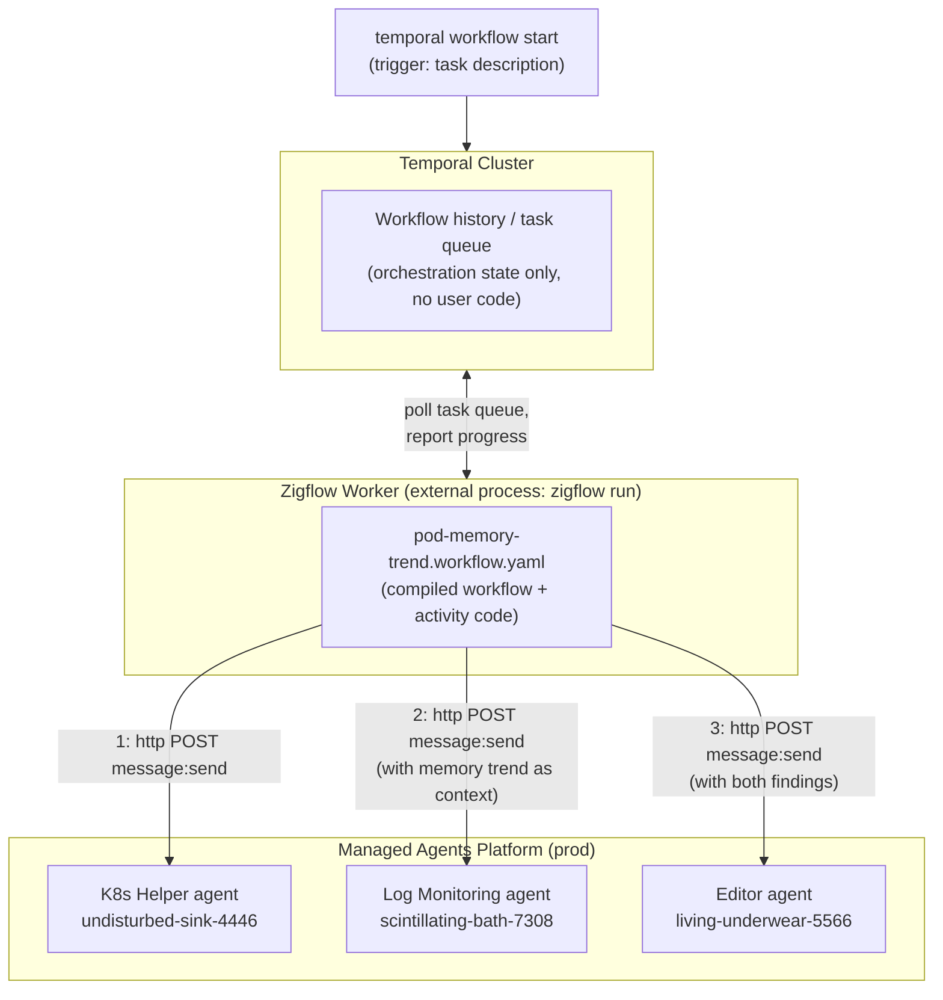
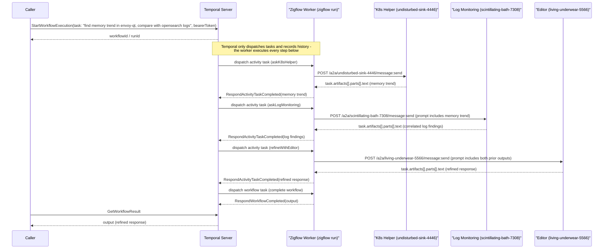

# Pod Memory Trend Investigation Demo — Architecture

Demonstrates a Temporal workflow, defined declaratively with Zigflow, that
orchestrates a sequential chain of agents on the Managed Agents platform via
the A2A protocol.

## Goal

Given a simple task ("find the latest memory trends in the envoy-qt pod,
compare with logs in OpenSearch"), run a sequential agent pipeline: a
Kubernetes-focused agent finds the memory trend, a log-monitoring agent
correlates that trend against OpenSearch logs, and an editor agent refines
the combined findings into one final response.

## Environment

This demo targets **production** (`api.agents.sixt.cloud`).

## Components

- **Zigflow workflow** (`pod-memory-trend.workflow.yaml`) — declares the
  orchestration in YAML (CNCF Serverless Workflow DSL). No custom code;
  every step is a `call: http` task, run sequentially — each step's prompt
  is built from the previous step's output.
- **Temporal** — durable execution engine. Zigflow compiles the YAML into a
  Temporal workflow and registers it on a worker (`zigflow run`).
- **Managed Agents platform** (`api.agents.sixt.cloud`) — hosts the agents.
  Each agent is addressed over A2A's HTTP+JSON REST binding at
  `POST /a2a/{agentID}/message:send`, bearer-token authenticated.
- **Agents used in the demo:**
  - `undisturbed-sink-4446` — K8s Helper (analyzes memory trend for the
    `envoy-qt` pod)
  - `scintillating-bath-7308` — Log Monitoring (searches OpenSearch for
    logs correlating with the memory trend)
  - `living-underwear-5566` — Editor (refines both findings into a single
    response)

## Component View



Temporal never executes workflow/activity code itself — it only persists
history and hands out tasks. `zigflow run` is the worker process that long-
polls Temporal's task queue, executes the compiled YAML (including the
`call: http` steps that reach the agents), and reports results back. In this
demo that worker runs locally (`zigflow run --file pod-memory-trend.workflow.yaml`),
but it's an ordinary Temporal worker and could run anywhere with network
access to both Temporal and the Managed Agents platform.

## Runtime View — Sequential Chain

Each step depends on the previous one's output, so the workflow is a plain
sequence (`do:` list), not a fork/join:

1. **K8s Helper** looks at the `envoy-qt` pod and reports the memory trend
   (e.g. "memory usage climbed steadily from 14:00, spiked at 14:32").
2. **Log Monitoring** receives that trend as context and searches OpenSearch
   for log entries around the same window, looking for correlating errors or
   events.
3. **Editor** receives both raw findings and refines them into one final,
   readable response.

Four participants, each with a different job:

- **Caller** — starts the workflow (`temporal workflow start`) and reads its
  final result. Only talks to the Temporal Server.
- **Temporal Server** — durable orchestrator. It never runs workflow or
  activity code. It records history, decides what's runnable next, hands work
  to the Zigflow Worker via task queue dispatch, and persists whatever result
  the worker reports back. It has no idea an HTTP call or an agent exists.
- **Zigflow Worker** (`zigflow run`) — long-polls Temporal for work, executes
  the actual step (a `call: http` task in the compiled YAML), and reports the
  activity's result (or failure, for Temporal to retry) back to Temporal. This
  is the only participant that ever calls out to an agent.
- **Managed Agents** — plain HTTP+JSON A2A endpoints; stateless from
  Temporal's point of view, they just answer whatever request the Zigflow
  Worker sends.



## Request/Response Shape (A2A REST binding)

Confirmed against the live prod endpoint (`api.agents.sixt.cloud`). Each
`call: http` task POSTs:

```json
{
  "message": {
    "messageId": "<uuid>",
    "role": "ROLE_USER",
    "parts": [ { "text": "<prompt text>" } ]
  }
}
```

Auth: `Authorization: Bearer <platform JWT>`.

Response (blocking call, `returnImmediately` unset/false):

```json
{
  "task": {
    "id": "...",
    "artifacts": [ { "parts": [ { "text": "<agent reply>" } ] } ],
    "status": { "state": "TASK_STATE_COMPLETED" }
  }
}
```

The reply text is read via `${ $data.<stepName>.task.artifacts[0].parts[0].text }`
in later workflow steps — e.g. the Log Monitoring step's prompt embeds
`${ $data.askK8sHelper.task.artifacts[0].parts[0].text }` to pass along the
memory trend, and the Editor step's prompt embeds both prior outputs.

## Why `call: http`, not `call: activity`

Zigflow's `call: activity` requires a separately deployed Temporal activity
worker (custom Go/Java/etc. code) registered on a task queue. Since the
platform already exposes agents over a plain authenticated REST endpoint,
`call: http` reaches them directly from the YAML with no custom worker code —
the simplest orchestration path for this demo.

## Out of scope

- Token minting/refresh inside the workflow (the demo takes a bearer token as
  workflow input; a production version would add a `call: http` step against
  the identity provider, or a Temporal activity wrapping a token cache).
- Streaming (`message:stream`) — the demo uses the blocking `message:send`
  call for simplicity.
- Parallel fan-out — this scenario is inherently sequential (the log search
  needs the memory trend as context), so no `fork` task is used.
