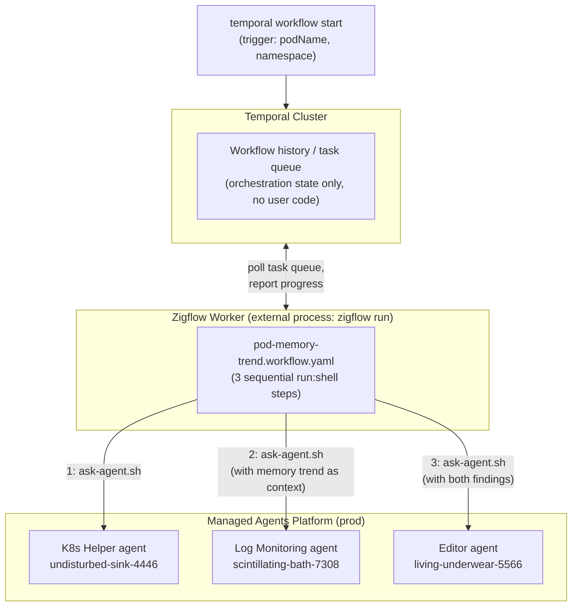
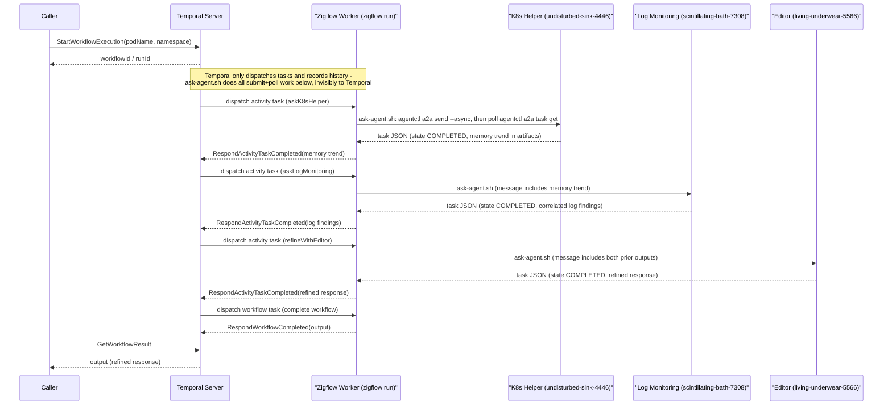

# Pod Memory Trend Investigation Demo — Architecture

Demonstrates a Temporal workflow, defined declaratively with Zigflow, that
orchestrates a sequential chain of agents on the Managed Agents platform via
the A2A protocol.

## Goal

Given a simple task ("find the latest memory trends in the envoy-qt pod,
compare with logs in OpenSearch"), run a sequential agent pipeline: a
Kubernetes-focused agent finds the memory trend, a log-monitoring agent
correlates that trend against OpenSearch logs, and an editor agent refines
the combined findings into one final response.

## Environment

This demo targets **production** (`api.agents.sixt.cloud`).

## Components

- **Zigflow workflow** (`pod-memory-trend.workflow.yaml`) — declares the
  orchestration in YAML (CNCF Serverless Workflow DSL). Three sequential
  steps, each a `run: shell` task — no `call: http`/`call: activity`, and no
  zigflow-native polling constructs (`for`/`while`/`try`/`catch`); see
  [Why a shell script, not `call: http`](#why-a-shell-script-not-call-http)
  for why.
- **`scripts/ask-agent.sh`** — the script every step runs. It submits a
  message to one agent, polls until the agent's task reaches a terminal
  state, and prints the final task JSON to stdout. See
  [The `ask-agent.sh` script](#the-ask-agentsh-script) below.
- **`agentctl`** — the CLI the script wraps (`agentctl a2a send`,
  `agentctl a2a task get`). It owns token refresh, the actual A2A wire
  protocol, and JSON parsing/printing — the workflow never talks to the A2A
  REST API directly.
- **Temporal** — durable execution engine. Zigflow compiles the YAML into a
  Temporal workflow and registers it on a worker (`zigflow run`).
- **Managed Agents platform** (`api.agents.sixt.cloud`) — hosts the agents,
  addressed via `agentctl`'s A2A support.
- **Agents used in the demo:**
  - `undisturbed-sink-4446` — K8s Helper (analyzes memory trend for the
    `envoy-qt` pod)
  - `scintillating-bath-7308` — Log Monitoring (searches OpenSearch for
    logs correlating with the memory trend)
  - `living-underwear-5566` — Editor (refines both findings into a single
    response)

## Component View



Temporal never executes workflow/activity code itself — it only persists
history and hands out tasks. `zigflow run` is the worker process that long-
polls Temporal's task queue, executes the compiled YAML (including the
`run: shell` steps that reach the agents), and reports results back. In this
demo that worker runs locally (`zigflow run --file pod-memory-trend.workflow.yaml`),
but it's an ordinary Temporal worker and could run anywhere with network
access to both Temporal and the Managed Agents platform (and with `agentctl`
installed and authenticated).

## Runtime View — Sequential Chain

Each step depends on the previous one's output, so the workflow is a plain
sequence (`do:` list), not a fork/join:

1. **K8s Helper** looks at the `envoy-qt` pod and reports the memory trend
   (e.g. spike timestamps, baseline vs. peak values).
2. **Log Monitoring** receives that trend as context and searches OpenSearch
   for log entries around the same window, looking for correlating errors or
   events.
3. **Editor** receives both raw findings and refines them into one final,
   readable response.

Four participants, each with a different job:

- **Caller** — starts the workflow (`temporal workflow start`) and reads its
  final result. Only talks to the Temporal Server.
- **Temporal Server** — durable orchestrator. It never runs workflow or
  activity code. It records history, decides what's runnable next, hands work
  to the Zigflow Worker via task queue dispatch, and persists whatever result
  the worker reports back. It has no idea a shell script, `agentctl`, or an
  agent exists.
- **Zigflow Worker** (`zigflow run`) — long-polls Temporal for work, executes
  the actual step (a `run: shell` task that invokes `ask-agent.sh`), and
  reports the activity's result (or failure, for Temporal to retry) back to
  Temporal. This is the only participant that ever calls out to an agent —
  and it does so entirely inside the opaque shell script, not via any
  zigflow-native HTTP/polling construct.
- **Managed Agents** — reached only through `agentctl`'s A2A client; stateless
  from Temporal's point of view, they just answer whatever `agentctl` sends.



## The `ask-agent.sh` script

Each step runs `scripts/ask-agent.sh <agentId> <message>`, which:

1. Submits the message without blocking:
   `agentctl a2a send <agentId> "<message>" --async` — prints
   `task <id> [submitted]` immediately and returns.
2. Parses that line. Per the A2A spec, `message:send` can resolve to either
   a `Task` (needs polling) or a bare `Message` (agent answered inline, no
   task to track) — the ~10% case. If the line isn't `task ...`, the script
   treats it as the direct answer and synthesizes an equivalent
   `{"status":{"state":"TASK_STATE_COMPLETED"},"artifacts":[...]}` shape so
   downstream parsing doesn't need to special-case it.
3. Otherwise, polls `agentctl a2a task get <id> --agent <agentId>` every 5
   seconds (up to 40 times) until `status.state` is `TASK_STATE_COMPLETED` or
   `TASK_STATE_FAILED`, then prints that task JSON to stdout.

```sh
SEND_OUT=$(agentctl a2a send "$AGENT_ID" "$MESSAGE" --async 2>/dev/null)
case "$SEND_OUT" in
  "task "*)
    TASK_ID=$(echo "$SEND_OUT" | awk '{print $2}')
    for i in $(seq 1 40); do
      sleep 5
      agentctl a2a task get "$TASK_ID" --agent "$AGENT_ID" > "$TMPFILE" 2>/dev/null
      STATE=$(python3 -c "import json; print(json.load(open('$TMPFILE'))['status']['state'])")
      if [ "$STATE" = "TASK_STATE_COMPLETED" ] || [ "$STATE" = "TASK_STATE_FAILED" ]; then
        cat "$TMPFILE"; exit 0
      fi
    done
    ;;
  *) # bare Message reply — synthesize an equivalent shape
    ;;
esac
```

The poll result is written to a temp file, not a shell variable — piping a
captured `$(...)` variable through `echo | python3 -c "json.load(sys.stdin)"`
was observed to mangle the JSON (see [Pitfalls](#pitfalls-hit-building-this)).

Each workflow step's `export.as` then parses that stdout with zigflow's jq
expression engine: `${ ($data.<stepName> | fromjson).artifacts[0].parts // [] | map(.text) | join("\n") }`
— joining every part of the (often multi-part, step-by-step) agent reply into
one string.

## Why a shell script, not `call: http`

The first version of this workflow used zigflow's native `call: http` task,
POSTing directly to the A2A REST endpoint
(`POST /a2a/{agentID}/message:send`) and blocking for the response. Two
problems surfaced:

1. **Gateway timeout.** The platform's own HTTP gateway/ingress in front of
   `api.agents.sixt.cloud` intermittently drops connections at ~60–90s if the
   agent hasn't replied yet (`504 Gateway Timeout`, or `curl` exit 56 when
   using a raw HTTP client) — well within how long these agents can
   legitimately take to finish a real investigation.
2. **Async polling inside zigflow was worse.** Switching to the A2A async
   pattern (`configuration.returnImmediately: true`, then poll
   `GET /tasks/{id}`) avoids the gateway timeout at the *request* level, but
   requires a poll loop. zigflow's `for`/`while` task type runs each
   iteration as an **isolated child workflow**, and `$context` set by a
   preceding sibling task — or updated inside the loop itself — was
   repeatedly not visible where expected: a freshly-submitted task ID read as
   `null` on the very first iteration, and even once that was worked around,
   the loop's own `while` exit condition failed to see the poll's own status
   update and kept iterating past completion. Three independent bugs later,
   the loop-based approach was abandoned (see
   [Pitfalls](#pitfalls-hit-building-this)).

Moving the entire submit+poll cycle into `scripts/ask-agent.sh` sidesteps
both problems at once: from zigflow's point of view each `run: shell` step is
a single opaque activity — it submits, waits, and returns one final result.
There is no intermediate poll state for zigflow's `$context`/`for` handling
to ever see or mishandle, and no single HTTP call blocks long enough to hit
the gateway's timeout.

The tradeoff: the actual A2A protocol exchange (submit, poll, terminal-state
check) is opaque to the workflow definition — it lives in bash, not YAML —
so it's less visible as "the workflow" when reading the `.workflow.yaml`
file alone.

## Token handling

`agentctl` owns bearer token refresh entirely — the workflow never sees or
passes a token. Each `agentctl a2a send`/`task get` call transparently
refreshes `agentctl`'s cached credentials as needed, so a single
`run: shell` step's retries (or its internal multi-minute poll loop) always
use a currently-valid token, without the workflow needing a separate
token-fetch step or having to reason about the platform's ~5-minute token
lifetime.

## Pitfalls hit building this

Kept here because each cost real debugging time and the fixes aren't
obvious from the final code:

- **`$data.<taskName>` namespacing.** A step's own result is *not* exposed as
  bare `$data` to a later step — it's namespaced under a key equal to the
  producing step's own name, e.g. `$data.askK8sHelper`. Reading `$data.task…`
  instead of `$data.askK8sHelper.task…` from a downstream step silently
  resolves to `null` (masked further if guarded with a `// []` fallback,
  which is why this bug surfaced twice).
- **`for` loop `$context` propagation.** Each `for` iteration runs as an
  isolated child workflow. Values set by a preceding sibling task (or by an
  earlier iteration) are not reliably visible inside the loop — including,
  fatally, the loop's own `while` exit condition reading a status field the
  loop's own body just updated.
- **`for.each` variable scope.** The loop item is addressed as `$data.<name>`
  (the `for.each` name is a field *under* `$data`), not as a bare `$<name>`
  variable — mirrors the `$data.<taskName>` rule above.
- **jq string concatenation inside object literals needs parens.**
  `{ text: "a" + b }` is a jq syntax error; it must be
  `{ text: ("a" + b) }`. `zigflow validate` does not appear to deep-syntax-check
  jq bodies, so this only surfaces at runtime.
- **`sh -c` positional args.** With `sh -c "script" arg1 arg2`, `arg1` becomes
  `$0` inside the script (conventionally the "program name"), not `$1` — the
  real arguments start at `$1`/`$2` only if a dummy placeholder is inserted
  as the first element after the script string.
- **Round-tripping JSON through a shell variable can corrupt it.**
  `RESULT=$(some-command); echo "$RESULT" | python3 -c "json.load(sys.stdin)"`
  broke on embedded control characters that a straight `some-command > file`
  redirect preserved intact. Prefer files over variables for JSON payloads
  in shell.
- **Retrying the same `messageId` after a timeout got an empty response.**
  When a Temporal activity retry replayed a `call: http` request with a
  fixed `messageId` (generated once via a `set` task), a retry after a
  platform-side timeout sometimes got back an empty/duplicate response for
  that message ID rather than a fresh answer — surfacing as a
  `jq: cannot iterate over: null` crash in the artifacts-parsing expression.
- **Temporal's built-in activity retry reuses the same input across
  attempts.** A bearer token fetched once before the first attempt is reused
  on every retry of that activity, including retries minutes later after the
  platform's ~5-minute token lifetime has expired — this is one of the
  reasons the final design lets `agentctl` own token refresh per-call instead
  of fetching a token once per workflow step.
