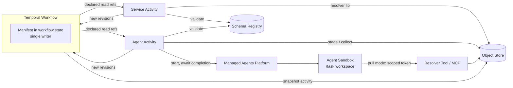
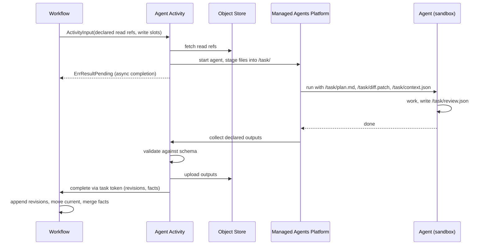

# Task Envelopes: Reference-Based Data Passing for Temporal Workflows with Agents and Services

**Status:** Draft v2 · **Date:** 2026-09-19

**Changes in v2:** slots hold append-only revision lists with a `current` pointer; lineage references digests instead of slot names; the workflow owns the manifest in its state and is its single writer; activities receive only declared refs and return new revisions.

## 1. Context

Temporal workflows orchestrate activities executed by two kinds of workers:

- **Regular microservices**, which need typed, machine-parseable contracts.
- **AI agents** (via the Managed Agents Platform), which work best with readable, file-based artifacts.

If activity inputs and outputs carry full data, they are persisted in Event History. That runs into the per-payload limit (2 MB, fixed on Temporal Cloud) and makes histories large and slow. We need a way to pass data between activities that fits both consumer types, with tenancy, lineage and auditability built in.

## 2. Goals and non-goals

**Goals**

- Keep Event History small: workflows carry references, not data.
- One data model usable by both services (typed) and agents (readable files).
- Idempotent under activity retries.
- Unambiguous lineage: which activity produced which artifact revision from which input revisions.
- Tenant isolation and least-privilege access, including for agents.
- Additive schema evolution without breaking in-flight workflows.

**Non-goals**

- Transparent payload offloading for arbitrary payloads. Temporal's External Storage covers that and can be used as a safety net alongside this design.
- A general-purpose artifact store or data catalog.

## 3. Prior art

This is an explicit, application-level variant of the **Claim Check** pattern (Enterprise Integration Patterns; documented in Temporal's docs and cookbook). The design borrows from:

| Concern | Borrowed from |
|---|---|
| Reference format (`mediaType`, `digest`, `size`, `annotations`) | OCI content descriptors / ORAS |
| Content addressing | OCI registries, Git |
| Lineage | OpenLineage, ML Metadata |
| Typed payloads with schema references | CloudEvents `datacontenttype` / `dataschema` |

The combination of named slots with revision lists, inline facts, workflow-owned manifests and the dual agent/service access path is our own design and not yet validated elsewhere.

## 4. Overview



- The **workflow** owns the manifest (refs and facts only) and merges activity results deterministically.
- **Activities** are the only boundary where data is resolved or written. They receive only the refs they declared and return new slot revisions.
- **Agents** never access storage directly, except through a scoped resolver tool in pull mode.
- **Snapshots** of the manifest are written to the object store at checkpoints for audit, UI and external consumers.

## 5. Data model

### 5.1 Ref

A reference is an OCI content descriptor, adopted as-is:

```json
{
  "mediaType": "application/json",
  "digest": "sha256:44dd…",
  "size": 18234,
  "urls": ["s3://bucket/platform/sha256/44dd…"],
  "annotations": {
    "schema": "codereview.findings/v2",
    "createdAt": "2026-09-18T10:12:00Z"
  }
}
```

The descriptor describes the content only. Provenance (producer, inputs, reason) lives on the revision entry in the manifest (5.2), because the same content may be produced more than once.

### 5.2 Manifest

```json
{
  "version": 2,
  "task": "T-4711",
  "tenant": "platform",
  "facts": { "status": "replanned", "findings": 3 },
  "slots": {
    "plan": {
      "current": "sha256:22bb…",
      "revisions": [
        { "ref": { "...": "Ref, digest sha256:11aa…" },
          "producedBy": "planner#1", "reason": "initial", "inputs": ["sha256:00ff…"] },
        { "ref": { "...": "Ref, digest sha256:22bb…" },
          "producedBy": "planner#2", "reason": "review feedback",
          "inputs": ["sha256:11aa…", "sha256:44dd…"] }
      ]
    },
    "review": {
      "current": "sha256:44dd…",
      "revisions": [
        { "ref": { "...": "Ref, digest sha256:44dd…" },
          "producedBy": "review-agent#1", "reason": "initial",
          "inputs": ["sha256:11aa…", "sha256:33cc…"] }
      ]
    },
    "review.md": {
      "current": "sha256:55ee…",
      "revisions": [
        { "ref": { "...": "Ref, digest sha256:55ee…" },
          "producedBy": "render#1", "derivedFrom": "sha256:44dd…" }
      ]
    }
  }
}
```

### 5.3 Conventions

- **Stable slot names.** Slot names identify a role in the task (`plan`, `review`), never a version.
- **Append-only revision lists.** A new revision is appended and `current` moves to it. Revisions are never removed or replaced.
- **Digest-based lineage.** `inputs` and `derivedFrom` reference digests, never slot names. The review above stays unambiguously tied to plan revision `11aa…` after the plan is revised.
- **Reads resolve to `current` by default.** An activity may pin specific digests when it needs older revisions (e.g. to diff plan revisions).
- **`reason` on every revision.** Short free text; agents use it to understand why a revision exists.
- **Facts are tiny.** Only values the workflow branches on (status, counts, flags). Everything else goes behind a ref.
- **One canonical format per slot:**

| Content | Canonical format | Typical writer |
|---|---|---|
| Structured data | JSON + JSON Schema | Services; agents via validated structured output |
| Prose | Markdown | Agents |
| Code / changes | Native (`.patch`, sources) | Both |

- **Derived views** (e.g. Markdown rendering of JSON findings) are separate slots whose revisions carry `derivedFrom: <digest>`. A derived view is stale when its `derivedFrom` is not the source slot's `current`; it is regenerated only when a human or prose-oriented agent consumes it.

## 6. Storage

- **Object store (S3-compatible)** is the system of record for all artifacts and manifest snapshots. Objects are immutable.
- **Key layout:** `{tenant}/sha256/{hash}`. Content addressing makes retried writes idempotent, deduplicates identical artifacts, and lets the resolver verify integrity on read.
- **Ref registry (Postgres, optional):** maps digest → task, tenant, retention class, for garbage collection, audit and cross-task queries.
- Caches (e.g. Redis) may accelerate reads but are never the source of truth.

## 7. Manifest ownership

The manifest lives in **workflow state**, and the workflow is its **single writer**.

**Why**

- Parallel activities cannot fork the manifest; the workflow merges their results deterministically.
- Activities need no manifest fetch before doing work.
- Task state has one owner, consistent with Temporal's model.
- The manifest contains only refs and facts, so it stays small enough for workflow state.

**Merge rules**

- Results from parallel activities are applied in a deterministic order (e.g. order of activity scheduling).
- Two revisions for the same slot from parallel branches are both appended; `current` moves to the last one applied, and the workflow may emit a fact (e.g. `conflict.plan=true`) for explicit resolution.
- Activities should declare disjoint write slots where possible; overlapping writes in parallel branches are a design smell.

**Snapshots**

A snapshot activity writes the manifest to the object store at checkpoints (end of phase, before continue-as-new, on completion). Snapshots are content-addressed and chained via `parent`, and serve audit, UI and external consumers. They are not read back by the workflow.

**History size**

- Activities receive only their declared refs, not the whole manifest, so each scheduled-activity event stays small.
- The manifest grows with revisions. Long-running or loop-heavy workflows carry it across continue-as-new; if the revision count becomes large, older revisions are compacted into the latest snapshot and referenced by its digest.

## 8. Activity contract

Every activity declares which slots it reads and writes. The workflow resolves reads against the manifest and passes only those refs:

```go
type ActivityInput struct {
    Task   string
    Tenant string
    Reads  map[string]Ref // slot -> resolved revision (current unless pinned)
    Writes []string       // slots this activity may produce; schemas from registry
}

type Revision struct {
    Ref        Ref
    ProducedBy string
    Reason     string
    Inputs     []string // digests
}

type ActivityResult struct {
    Revisions map[string]Revision // slot -> new revision (only declared write slots)
    Facts     map[string]string
}
```

Declared reads and writes drive access scoping, validation, staging and merging. The workflow rejects results for undeclared slots.

## 9. Access paths

### 9.1 Services

The worker uses a shared **resolver library** that checks tenancy, fetches the passed refs, verifies digests, and decodes into Go types generated from JSON Schema. Outputs are validated, uploaded, and returned as revisions.

### 9.2 Agents: push mode (default)



- The agent sees a plain workspace: input files plus a `context.json` describing staged slots, their revision reasons and lineage.
- Older revisions are staged only when the task needs them (e.g. `plan.prev.md` or a diff).
- Only declared output files are collected; everything else in the workspace is discarded.
- Validation failures surface as retryable activity errors, so malformed agent output never reaches downstream services.

### 9.3 Agents: pull mode

For large or unpredictable inputs, the agent gets a resolver tool (MCP) with `list_slots`, `read_slot`, `write_slot`. It authenticates with a **token scoped to task, tenant, attempt and the declared slot set**: read-only on declared input revisions, write-only on declared output slots. Writes go to a staging area and are validated and returned as revisions by the activity on completion, as in push mode.

Hybrid is common: push small core inputs, pull large or optional ones.

### 9.4 Long-running agents

Agent activities must not block a worker for the agent's full runtime. Preferred: **async completion** (`ErrResultPending`, platform completes via task token). Alternative: heartbeat while polling. Either way, heartbeat and start-to-close timeouts must be set so that cancellation and lost agents propagate to the workflow.

## 10. Schema registry and evolution

- JSON Schemas live in a versioned registry (initially a Git repo), named `{domain}.{artifact}/v{major}`.
- Minor changes are additive only; breaking changes create a new major version.
- Manifest `version` follows the same rule; readers must ignore unknown fields. Workflow code changes to manifest handling use Temporal versioning (`GetVersion` / worker versioning).
- In-flight workflows keep working because stored artifacts are immutable and self-describing (`mediaType` + `schema`).

## 11. Security and tenancy

- Tenant prefix in keys enables prefix-scoped IAM and lifecycle rules.
- Services use workload identity with tenant-scoped access.
- Agents never receive storage credentials. In pull mode they get short-lived, per-attempt tokens limited to declared slots, minted by the activity.
- Resolver enforces: tenant match, digest verification, declared-slot check.
- Revision entries (`producedBy`, `inputs`, `reason`) and manifest snapshots provide the audit trail.

## 12. Lifecycle and retention

- Artifact retention must be at least **workflow retention + reset/replay window**; otherwise resets and replays break.
- GC runs from the ref registry: artifacts are deleted when no retained snapshot or live workflow references them. Content addressing means a digest may be shared across tasks, so deletion is reference-counted.
- Superseded revisions are retained with the task; they are needed for lineage.
- Retention classes (e.g. `ephemeral`, `audit`) set per slot type.

## 13. Observability

- Log and trace attributes: task ID, slot, revision digest, activity attempt.
- Workflow query handler returning the current manifest, plus a small UI plugin to resolve refs from the Temporal Web UI.
- Metrics: artifact sizes, revisions per slot, resolve latency, validation failures by schema and producer.

## 14. Alternatives considered

| Option | Why not (as primary) |
|---|---|
| Inline payloads | Hits 2 MB limit; bloats history |
| Temporal External Storage only | Transparent but untyped; no lineage, slots or agent staging. Keep as safety net |
| Versioned slot names (`plan.v2`) | Pushes version semantics into strings; consumers must parse names to find the latest |
| Overwriting slots in new manifest versions | No data loss (manifests are immutable), but lineage by slot name becomes ambiguous |
| Manifest as stored artifact, activities write new versions | Parallel branches fork the manifest; requires merge steps and a fetch per activity |
| Git repo per task | Great lineage and readability; weak GC, poor for large blobs, repo-per-task overhead. Possible later as a read view |
| Markdown frontmatter for metadata | Readable, but services would have to parse content to get metadata |

## 15. Open questions

1. Is the ref registry required from day one, or can GC initially rely on bucket lifecycle rules alone?
2. Snapshot cadence: per activity, per phase, or only on completion and continue-as-new?
3. Revision compaction threshold for long-running workflows.
4. Parallel writes to the same slot: allow with conflict fact, or forbid at workflow definition time?
5. Pull-mode token format: reuse the existing agent identity / scoped credential system directly?
6. Who owns the schema registry, and what is the review process for new schemas?
7. Size threshold below which small slot contents may be inlined in the revision entry.
