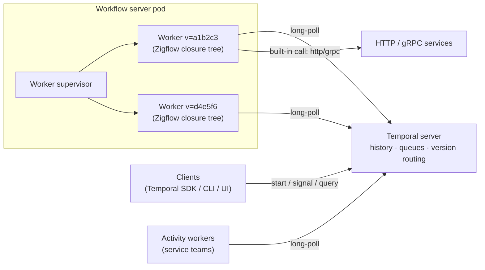
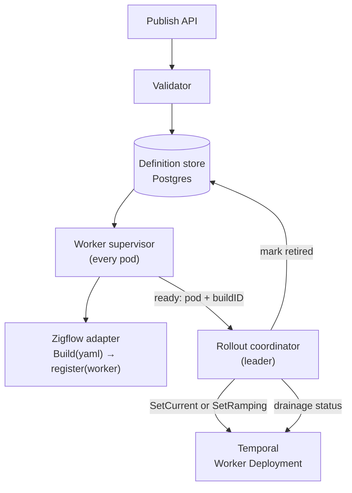
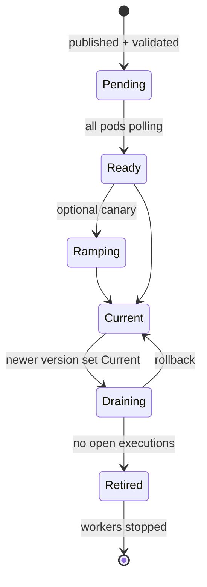
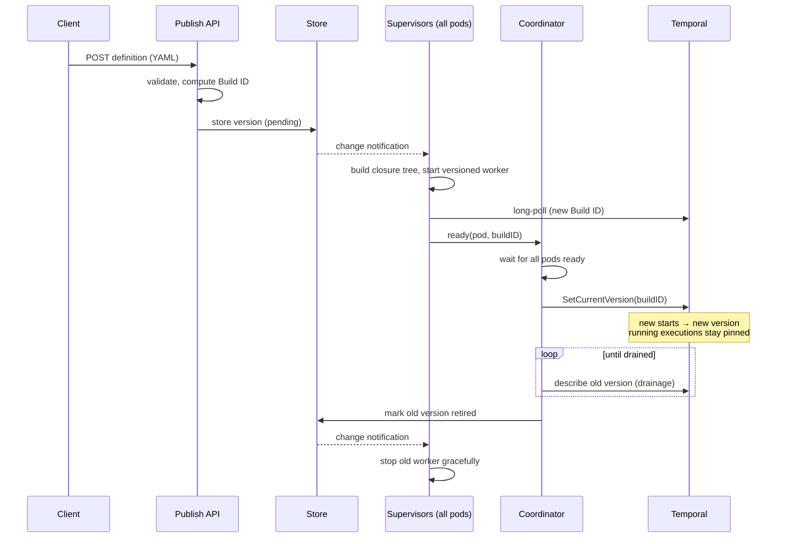

# Zigflow Workflow Server — Architecture

*Draft · 2026-09-18*

## Purpose and scope

The workflow server runs Zigflow YAML definitions as Temporal workflows and swaps definitions at runtime without restarting, delegating version routing to Temporal Worker Deployments.

**Goals**

- Publish, update and retire workflow definitions via API, with no process restart.
- Never break in-flight executions: each execution completes on the definition it started with.
- Scale horizontally as a stateless fleet of pods.
- Keep tenants isolated at the namespace / task-queue level.

**Non-goals**

- Implementing domain activities. These stay in separate activity workers (any Temporal SDK).
- Replacing the Temporal server, UI or client SDKs for starting, signalling or querying workflows.
- In-place upgrades of running executions to a new definition (v1).

## Context

The server is a Temporal workflow worker host: Temporal holds state and routes tasks, the server runs orchestration logic built from YAML, and activity workers do the domain work.



| Part | Role | Owned by |
| --- | --- | --- |
| Temporal server | Event history, task queues, timers, retries, Worker Deployment version routing. Runs no business code. | Platform (or Temporal Cloud) |
| Workflow server | Loads YAML, builds Zigflow closure trees, runs one Temporal worker per definition version, drives version rollout. | Platform |
| Zigflow (embedded) | Parses and validates YAML, builds the workflow function, provides built-in activities (HTTP, gRPC, container). | Upstream, pinned |
| Activity workers | Domain activities called via `call: activity` on their own task queues. | Service teams |
| Clients | Start, signal, query and update executions via standard Temporal clients. | Callers |

All communication with Temporal is outbound gRPC long-polling from workers. No component needs an inbound port for workflow traffic.

## Components

Six components; all but the definition store run inside each server pod, and only the coordinator needs leader election.



| Component | Responsibility | Runs |
| --- | --- | --- |
| Definition store | Source of truth: tenant, logical name, YAML, Build ID, desired state (active / retired). | External DB (Postgres) |
| Publish API | Accepts new YAML, validates it, computes Build ID, writes to the store. | Every pod |
| Validator | JSON Schema check, Zigflow validation (expressions, determinism), policy checks (e.g. no `run: shell`). | Every pod, in-process |
| Worker supervisor | Reconciles running workers against the store: builds closure tree, starts a versioned worker per (tenant, Build ID), stops drained ones. Reports readiness. | Every pod |
| Rollout coordinator | Once all pods report a version polling, sets it Current (or Ramping). Tracks drainage and marks old versions retired. | Leader-elected, one active |
| Zigflow adapter | Thin seam over Zigflow internals: `Build(yaml) -> register(worker)`. Isolates upstream API churn. | Library in every pod |

The supervisor is level-triggered: on start and on every store change it recomputes desired workers, so pod restarts and missed events self-heal.

## Versioning model

Every definition revision is an immutable Worker Deployment Version whose Build ID is a hash of its YAML and the Zigflow version, and every workflow type is Pinned.

| Temporal concept | Mapping |
| --- | --- |
| Worker Deployment | One per tenant and logical workflow set, e.g. `zigflow-<tenant>` |
| Build ID | First 12 hex chars of SHA-256 over normalized YAML + Zigflow version |
| Deployment Version | Deployment name + Build ID = one immutable definition revision |
| Current Version | Where new executions start; set by the rollout coordinator |
| Ramping Version | Optional canary: a percentage of new starts |
| Versioning behavior | Pinned, as the worker-level default |



**Why Pinned.** The Zigflow DSL has no patching primitive, so a changed definition cannot safely replay an old history. Pinned guarantees each execution finishes on the version it started on, making any YAML change safe.

**Worker configuration.** Each worker sets `UseVersioning: true`, its `WorkerDeploymentVersion`, and `DefaultVersioningBehavior: Pinned`. The default is required: Zigflow registers workflow types without a per-type behavior, and a versioned worker without one fails at registration.

```go
w := worker.New(c, taskQueue, worker.Options{
    DeploymentOptions: worker.DeploymentOptions{
        UseVersioning: true,
        Version: worker.WorkerDeploymentVersion{
            DeploymentName: "zigflow-" + tenant,
            BuildID:        buildID,
        },
        DefaultVersioningBehavior: workflow.VersioningBehaviorPinned,
    },
})
adapter.Build(yaml).Register(w) // Zigflow seam
w.Start()
```

**Identical input** yields the same Build ID, so re-publishing is idempotent.

## Key flows

A definition change is publish, converge, flip, drain; callers never see it.



**Start an execution.** Callers use a standard Temporal client with workflow type + task queue. Temporal routes the first task to a worker of the Current (or Ramping) version; the execution stays pinned there until it completes.

**Rollback** is a flip back to the previous Build ID, whose workers are still running while it drains.

## Multi-tenancy and isolation

Tenants are separated by Temporal namespace, and nothing tenant-authored executes arbitrary code inside the server process.

- **Namespace per tenant.** Separate histories, retention, rate limits and auth. Task queues and Worker Deployments live inside it.
- **No in-process code execution.** Policy rejects `run: shell` and `run: script` at validation. `run: container` uses the Kubernetes runtime, so steps run as Jobs in a tenant-scoped namespace, not in the server pod.
- **Outbound calls.** `call: http` / `grpc` built-ins run in the server process; egress is restricted by network policy, and credentials come from `$env` with a per-tenant prefix, never shared.
- **Blast radius.** Per-tenant caps on concurrent workflow tasks and activities per worker. A noisy tenant moves to a dedicated server pool by task-queue routing alone.
- **Trust tiers.** Platform-owned definitions share a pool; tenant-authored definitions run on a separate pool. Same binary, different config.

## Scaling and operations

Pods are stateless and identical; scale by adding replicas, and bound per-pod cost by capping active versions.

- **Horizontal scale.** Every pod runs every active version of its pool. Temporal spreads tasks across pollers; HPA scales on schedule-to-start latency per task queue.
- **Per-pod cost.** Each worker adds pollers, long-poll connections and sticky-cache share. Cap active versions per tenant (e.g. 3); publishing beyond the cap waits for drainage or needs an explicit force-retire.
- **Sticky cache.** Size `SetStickyWorkflowCacheSize` to pod memory; it is process-global and shared by all workers.
- **Shutdown.** On SIGTERM, stop workers gracefully so in-flight workflow tasks complete or hand back. Activities heartbeat and retry to survive eviction.
- **Observability.** Metrics per (tenant, Build ID): schedule-to-start latency, task failures, non-determinism errors, open executions per version. Alert on any non-determinism error; with Pinned it indicates a bug.
- **Upgrading Zigflow itself.** A new Zigflow release changes closure-tree code, so every definition gets a new Build ID (hence Zigflow version in the hash).

## Risks and open questions

The largest risk is coupling to Zigflow internals; the largest unknown is how long-lived pinned executions drain.

| Risk | Impact | Mitigation |
| --- | --- | --- |
| Zigflow Go API is internal and unstable | Upgrades break the adapter | Pin version, thin adapter seam, contract tests; propose a stable embedding API upstream |
| Long-lived executions (months-long `wait` loops) | Old versions never drain; version cap reached | Version cap + alerting; decide continue-as-new policy |
| Worker Deployments API maturity | Routing edge cases on some server versions | Pin server and SDK versions; integration tests per upgrade |
| Flip before all pods converge | Tasks reach pods lacking the version | Coordinator flips only on all-pods-ready |
| In-process HTTP/gRPC built-ins | Shared CPU, memory, egress | Concurrency caps, network policy, trust-tier pools |

**Open questions**

- [ ] Does Zigflow's automatic continue-as-new keep a pinned execution on its version or move it to Current?
- [ ] Minimum Temporal server and Go SDK versions for Worker Deployments in our setup?
- [ ] One Worker Deployment per tenant, or per tenant and workflow group?
- [ ] One namespace per tenant, or shared namespace isolated by task queue?
- [ ] Should replay-tested compatible changes auto-upgrade in v2?
